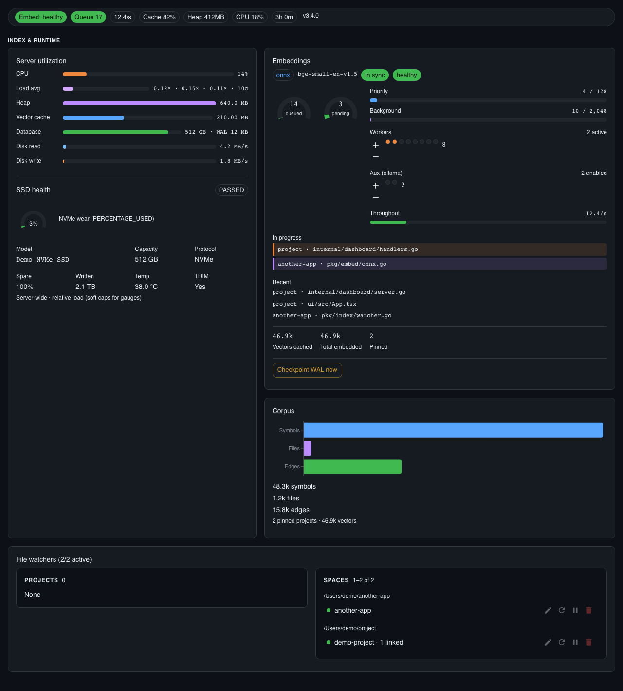
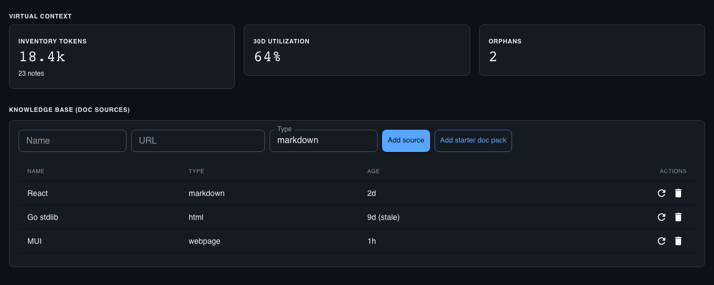
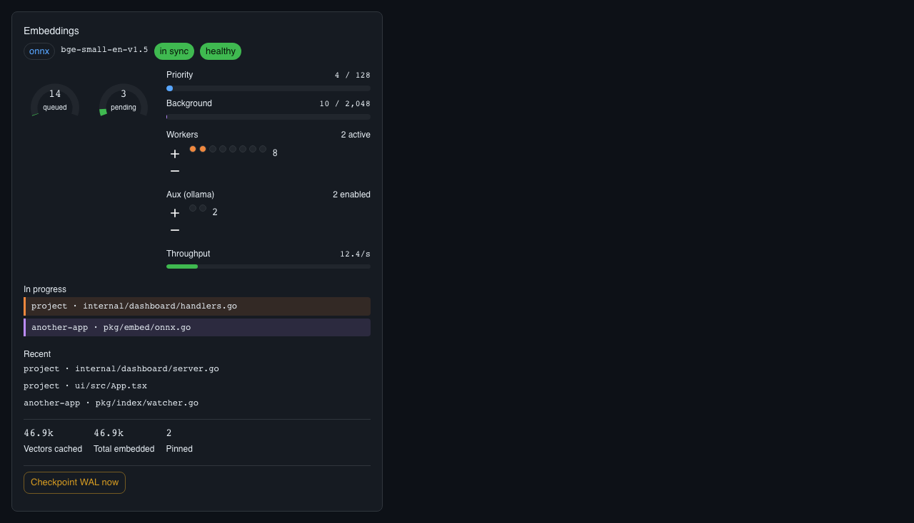
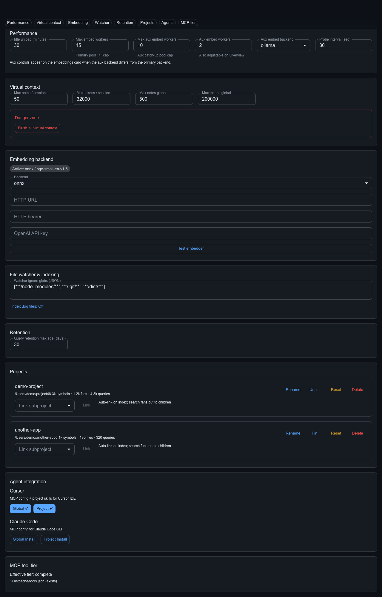

# ast-context-cache

[](https://github.com/coma-toast/ast-context-cache/releases)
[](#license)

A **local-first** AST context engine for AI coding agents: index with tree-sitter, search over MCP with minimal tokens, cache docs, and **offload conversation context before host compaction** so agents recover plans after the editor compacts chat. No cloud, no account, no data leaves your machine.

**Primary capabilities**

- **Token-efficient code search** — `auto` / `skeleton` / `summary` modes, session dedup, measured **Tokens saved** on the dashboard
- **Virtual context** — survive host compaction with `store_context` → `ctx_*` stubs → `fetch_context`
- **Local-first** — SQLite + optional local ONNX (or your own embed backend); nothing phones home
- **Operator dashboard** — live status on port **7830** (embed queue, savings, memory, settings)


Also: KV repair observability, structured memory (`mem_*`), hybrid BM25+vector search, impact graph, RAG `retrieve`, and offline doc caching — see [Features](#features).

## Quick Start

**Prerequisites:** Go 1.21+ with CGO enabled, and `brew` on macOS (for ONNX Runtime).

```bash
git clone https://github.com/coma-toast/ast-context-cache.git
cd ast-context-cache
make setup
make run
```

```
MCP: http://localhost:7821/mcp
Dashboard: http://localhost:7830
```

`make setup` installs ONNX Runtime, downloads the embedding model + tokenizer lib, and builds the binary. Embedding backends (Ollama, OpenAI-compatible, Docker Model Runner, …): **[`docs/embedding-backends.md`](docs/embedding-backends.md)**.

### After `git pull`

```bash
cp VERSION internal/version/VERSION   # or: make build
```

The React dashboard (`ui/`) rebuilds as part of `make build` via `ui-build`.

## Configure your editor

### Cursor

```json
{
  "mcpServers": {
    "ast-context-cache": {
      "url": "http://localhost:7821/mcp",
      "env": {
        "AST_MCP_TIER": "extended",
        "AST_MCP_CODE_MODE": "false"
      }
    }
  }
}
```

### OpenCode

```jsonc
{
  "mcpServers": {
    "ast-context-cache": {
      "url": "http://localhost:7821/mcp"
    }
  }
}
```

**Agents:** workflow, tool tiers, virtual context, and token tips live in **[`AGENTS.md`](AGENTS.md)** (and [`skills/usage/SKILL.md`](skills/usage/SKILL.md)). Do not duplicate that manual here — copy MCP JSON above, then follow AGENTS.md.

## Features

### Primary

| | |
|--|--|
| **Token-efficient search** | Hybrid BM25 + vectors; modes `auto` / `skeleton` / `summary` / `full`; session `session_id` dedup; dashboard **Tokens saved** |
| **Virtual context** | `store_context` / `fetch_context` / `search_context` / `flush_context` — local notes with stable `ctx_*` refs |
| **Local-first** | No cloud account; index and docs stay on disk under `~/.astcache/` |
| **Dashboard** | React UI on **7830**: health, Index & runtime, embeddings, memory, settings, WebSocket live updates |
| **KV repair** | `report_kv_repair_event`, golden-text archives, dashboard success-rate stats |
| **Structured memory** | Temporal facts + procedural rules (`store_memory` / `recall_memory` / `forget_memory`) |
| **Precise AST search** | Symbol-level index with source or skeleton in results; `get_impact_graph` blast radius |
| **RAG `retrieve`** | Hybrid search + rerank + assembly (code ± docs ± memory) |
| **Doc caching** | `fetch_doc` / `search_docs` — Context7-style offline library docs |

### Supporting

| | |
|--|--|
| **Embed backends** | ONNX, Ollama, HTTP, OpenAI/LiteLLM, Docker Model Runner — [`docs/embedding-backends.md`](docs/embedding-backends.md) |
| **Aux embedder pool** | Separate catch-up workers when primary is down or slow |
| **Languages** | Python, JS/JSX, TS/TSX, Go, Bash, Fish, YAML |
| **File watcher** | `fsnotify` incremental re-index with debounce and ignore globs |
| **Tool tiers** | `core` / `extended` / `complete` + `~/.astcache/tools.json` overrides |
| **Code-mode** | `execute_code` sandbox + `scripts/code-mode/` |
| **Pin / queue** | Bounded embed queue; pin projects for priority + warmer vectors |
| **Analysis / bundles** | Dead code, complexity, `.astbundle` export/import |
| **Supervise / Docker** | `ast-mcp supervise` or [`docker/ast-mcp`](docker/ast-mcp/README.md) |
| **Metrics** | Prometheus at `http://localhost:7830/metrics` (`astcache_` prefix) |

## Screenshots









Regenerate from React Storybook (fixtures, no live index required):

```bash
make dashboard-screenshot   # build ui/ Storybook → docs/images/*.png
make verify-stories         # Playwright smoke on key stories
```

Storybook: `make storybook` (port **6008**). Static build: `make build-storybook` → `docs/storybook-static/` (gitignored). Optional live visual check: `cd ui && npm run verify-visual-vs-live` (skips if dashboard is down; Webwright is fine as a manual alternate).

## Shell function (optional)

```bash
make install
```

```bash
ast-mcp start | supervise | stop | restart | status | health | log | build | dash
```

**Docker keep-alive:** `docker compose -f docker/ast-mcp/compose.yml up -d --build`. See [`docker/ast-mcp/README.md`](docker/ast-mcp/README.md).

## Optional: mcp-local launcher

This repo ships **`ast-mcp`** only. For a unified local MCP supervisor (start/merge config, tool tiers), see **[mcp-local](https://github.com/coma-toast/mcp-local)** and its [AGENTS.md](https://github.com/coma-toast/mcp-local/blob/main/AGENTS.md).

## Tool tiers

| Tier | Typical tools |
|------|----------------|
| **core** | Search, maps, docs, `retrieve`, context **read**, `recall_memory` |
| **extended** | + indexing, `store_context` / memory write, analysis, bundles |
| **complete** | + `execute_code` |

`AST_MCP_TIER` (default `complete`), `AST_MCP_CODE_MODE`, `AST_MCP_TOOLS_CONFIG` / `~/.astcache/tools.json`. Full tables and examples: [AGENTS.md](AGENTS.md#tool-tiers-server-policy), [`skills/tools.json.example`](skills/tools.json.example).

## Migrating to 3.0

| Change | What to do |
|--------|------------|
| Removed MCP ghost tools | `sync_remote` / `reset_*` gone from MCP; use local index + dashboard APIs |
| React-only dashboard | SPA at `http://localhost:7830/dashboard/` — not HTMX/templ |
| Keep-alive | `ast-mcp supervise` or Docker Compose `restart: unless-stopped` |
| Prometheus | Scrape `http://localhost:7830/metrics` |
| Overview confidence | Heuristics, weekly digest, session virtual-context stories |

Rebuild after upgrade (`make build` / `ast-mcp build`). Version: [`VERSION`](VERSION).

## Architecture

```
┌─────────────┐    JSON-RPC 2.0    ┌──────────────────┐
│  AI Agent    │ ◄───────────────► │  MCP Server :7821 │
│  (Cursor,    │                   │  tree-sitter AST  │
│   OpenCode)  │                   │  SQLite + FTS5    │
└─────────────┘                   │  Embeddings       │
                                   └────────┬─────────┘
                                            │
                                   ┌────────┴─────────┐
                                   │ Dashboard :7830  │
                                   │ React SPA + /metrics │
                                   └──────────────────┘
```

**Databases** (WAL, under `~/.astcache/`): `index.db` (symbols/vectors/edges), `context.db` (docs/virtual context/memory), `usage.db` (queries/sessions/settings).

### Environment (common)

| Variable | Description | Default |
|----------|-------------|---------|
| `ONNXRUNTIME_LIB` | ONNX Runtime library path | Auto-detected |
| `MODEL_DIR` | Model files | `./model` |
| `DB_PATH` | Base path for DBs | `~/.astcache/usage.db` |
| `EMBED_AUX_BACKEND` / `EMBED_AUX_WORKERS` | Aux catch-up pool | `onnx` / `0` |
| `AST_CONTEXT_MAX_*` / `AST_CONTEXT_LIMIT_POLICY` | Virtual context quotas | See AGENTS.md / Settings |

Embed backend env vars: [`docs/embedding-backends.md`](docs/embedding-backends.md). Non-empty env overrides dashboard Settings.

### Linux

Install ONNX Runtime (`libonnxruntime-dev` or [releases](https://github.com/microsoft/onnxruntime/releases)), then `make setup`.

### Cross-platform build

`make download-tokenizer-lib` pulls a pre-built `libtokenizers.a` for your `GOOS`/`GOARCH` from [daulet/tokenizers](https://github.com/daulet/tokenizers/releases).

## License

MIT
