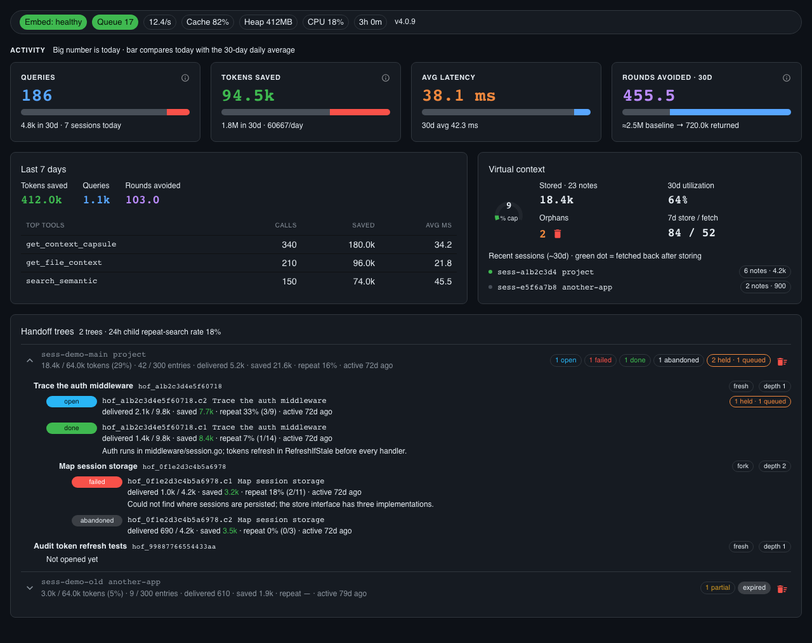
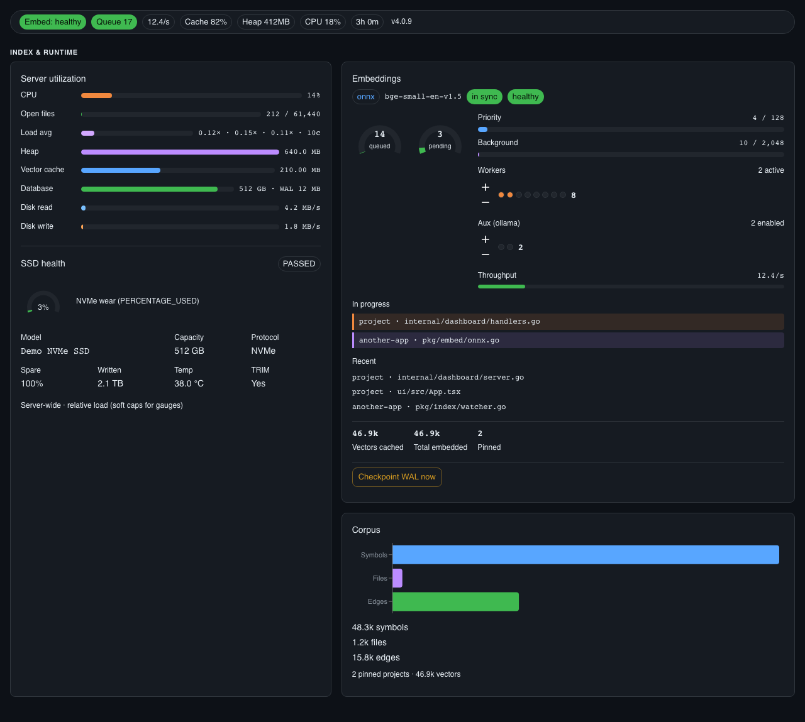
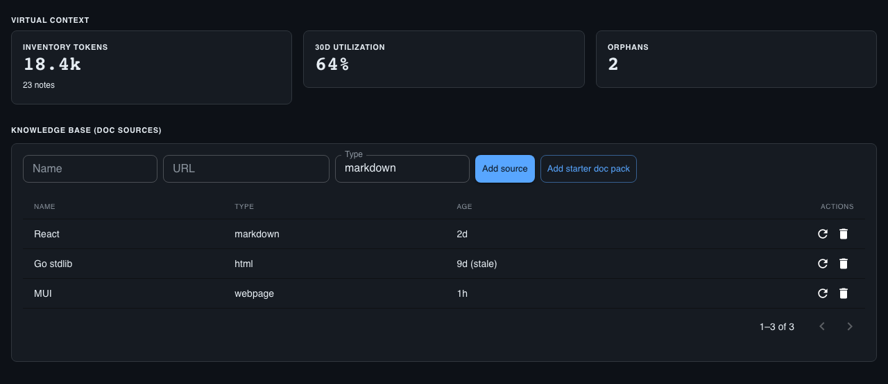
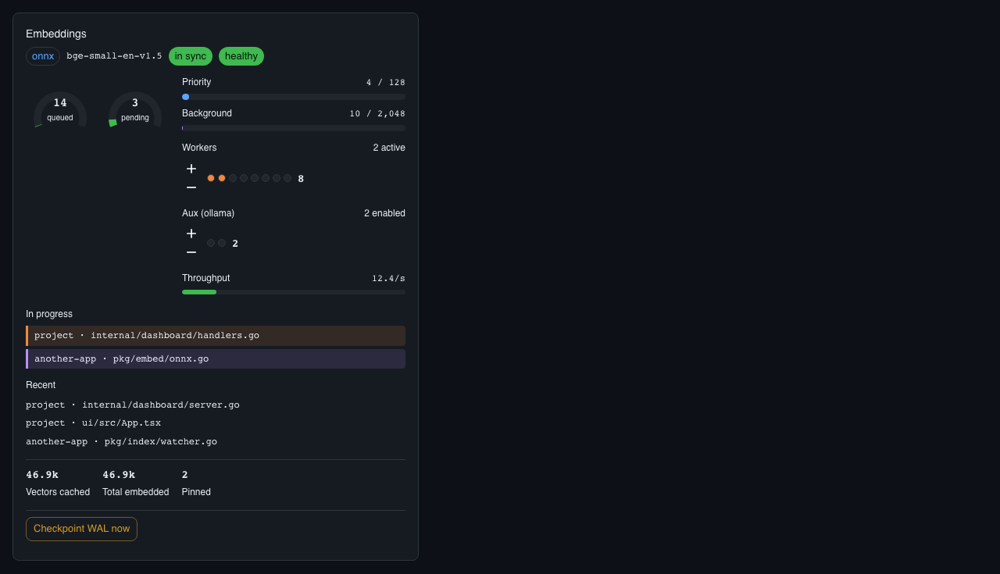
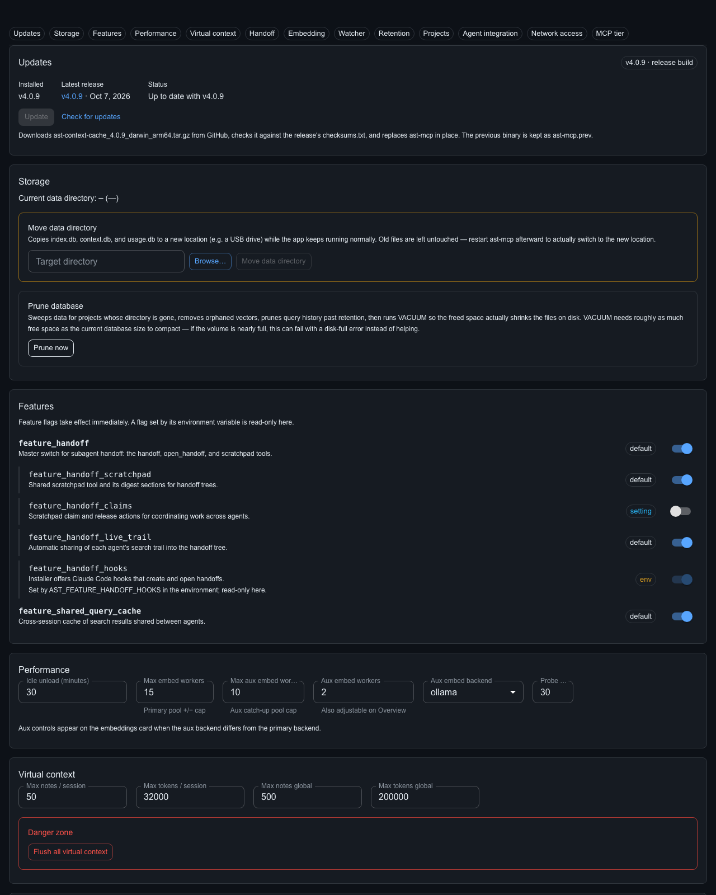

# ast-context-cache

[](https://github.com/coma-toast/ast-context-cache/releases)
[](#license)

A **local-first** AST context engine for AI coding agents: index with tree-sitter, search over MCP with minimal tokens, cache docs, and **offload conversation context before host compaction** so agents recover plans after the editor compacts chat. No cloud, no account, no data leaves your machine.

**Primary capabilities**

- **Token-efficient code search** — `auto` / `skeleton` / `summary` modes, session dedup, measured **Tokens saved** on the dashboard
- **Virtual context** — survive host compaction with `store_context` → `ctx_*` stubs → `fetch_context`
- **Subagent handoff** — a parent hands a subagent a snapshot of what it already explored (`handoff` → `[handoff hof_…]` stub → `open_handoff`), gets back a ref plus a short summary, and parallel children coordinate through a shared scratchpad — see [`docs/handoff.md`](docs/handoff.md)
- **Safe agent installer** — `ast-mcp install` or the dashboard registers the server, skills, and rules for 7 hosts with a preview diff, backups, and merge-only edits
- **Local-first** — SQLite + optional local ONNX (or your own embed backend); nothing phones home
- **Operator dashboard** — live status on port **7830** (embed queue, savings, memory, settings)



Also: KV repair observability, structured memory (`mem_*`), hybrid BM25+vector search, impact graph, RAG `retrieve`, offline doc caching, and live feature flags — see [Features](#features).

## Quick Start

**Prerequisites:** Go 1.21+ with CGO enabled, and `brew` on macOS (for ONNX Runtime).

```bash
git clone https://github.com/coma-toast/ast-context-cache.git
cd ast-context-cache
make setup
make run
```

```
MCP: http://127.0.0.1:7821/mcp
Dashboard: http://127.0.0.1:7830
```

Both bind `127.0.0.1` (and `[::1]`) by default; see [Migrating to 4.0](#migrating-to-40) for `--listen` / `AST_LISTEN`.

`make setup` installs ONNX Runtime, downloads the embedding model + tokenizer lib, and builds the binary. Embedding backends (Ollama, OpenAI-compatible, Docker Model Runner, …): **[`docs/embedding-backends.md`](docs/embedding-backends.md)**.

### After `git pull`

```bash
cp VERSION internal/version/VERSION   # or: make build
```

The React dashboard (`ui/`) rebuilds as part of `make build` via `ui-build`.

## Configure your editor

Use the installer. It previews a per-file diff, backs up every file it touches, and edits only its own entries, so your other servers, comments, and instructions stay intact:

```bash
ast-mcp install --target cursor --dry-run     # preview
ast-mcp install --target cursor --yes         # apply
ast-mcp verify                                # status for every host
```

`ast-mcp` is the [shell function](#shell-function-optional) from `make install`; `./ast-mcp` in the repo takes the same subcommands.

Targets: `claude_code`, `cursor`, `opencode`, `codex`, `claude_desktop`, `vscode`, `jetbrains` (or `all`). Components: `mcp`, `skills`, `rules`, `hooks` (Claude Code subagent-handoff hooks: available, opt-in behind the `feature_handoff_hooks` flag; see [`docs/handoff.md`](docs/handoff.md#claude-code-hooks)). The dashboard offers the same under Settings → **Agent integration**. Full CLI reference, exit codes, backups, and manual config snippets: [`docs/INSTALL.md`](docs/INSTALL.md#connect-your-agents). Exact files and keys per host: [`docs/host-integration.md`](docs/host-integration.md).

Manual config is a URL entry, for example Cursor's `~/.cursor/mcp.json`:

```json
{
  "mcpServers": {
    "ast-context-cache": { "url": "http://127.0.0.1:7821/mcp" }
  }
}
```

Do not add an `env` block to a URL entry; it has no effect. Set `AST_MCP_TIER` and other server settings on the `ast-mcp` process.

**Agents:** workflow, tool tiers, virtual context, handoff, and token tips live in **[`AGENTS.md`](AGENTS.md)** (and [`skills/usage/SKILL.md`](skills/usage/SKILL.md)). The installer ships the same guidance to each host as skills and an instruction block.

## Features

### Primary

| | |
|--|--|
| **Token-efficient search** | Hybrid BM25 + vectors; modes `auto` / `skeleton` / `summary` / `full`; session `session_id` dedup; dashboard **Tokens saved** |
| **Virtual context** | `store_context` / `fetch_context` / `search_context` / `edit_context` / `flush_context` — local notes with stable `ctx_*` refs, editable in place — [`docs/context-edit.md`](docs/context-edit.md) |
| **Context functions** | `define_context_fn` / `apply_context_fn` / `list_context_fns` — model-defined reusable transforms over stored notes, default off — [`docs/context-fn.md`](docs/context-fn.md) |
| **Subagent handoff** | `handoff` / `open_handoff` / `scratchpad` — snapshot-backed briefs for subagents, capped return summaries, shared scratchpad and advisory claims for parallel children, dashboard tree view — [`docs/handoff.md`](docs/handoff.md) |
| **Agent installer** | `ast-mcp install` / dashboard: MCP, skills, rules, and opt-in Claude Code handoff hooks for 7 hosts; preview diff, backups, merge-only — [`docs/host-integration.md`](docs/host-integration.md) |
| **Local-first** | No cloud account; index and docs stay on disk under `~/.astcache/` |
| **Dashboard** | React UI on **7830**: health, Index & runtime, embeddings, memory, handoff trees, settings, WebSocket live updates |
| **KV repair** | `report_kv_repair_event`, golden-text archives, dashboard success-rate stats |
| **Structured memory** | Temporal facts + procedural rules (`store_memory` / `recall_memory` / `forget_memory`) |
| **Precise AST search** | Symbol-level index with source or skeleton in results; `get_impact_graph`, `diff_impact`, `check_symbol_exists`, `check_deletion_safety` |
| **RAG `retrieve`** | Hybrid search + rerank + assembly (code ± docs ± memory) |
| **Doc caching** | `fetch_doc` / `search_docs` — Context7-style offline library docs |

### Supporting

| | |
|--|--|
| **Embed backends** | ONNX, Ollama, HTTP, OpenAI/LiteLLM, Docker Model Runner — [`docs/embedding-backends.md`](docs/embedding-backends.md) |
| **Aux embedder pool** | Separate catch-up workers when primary is down or slow |
| **Languages** | Python, JS/JSX, TS/TSX, Go, Bash, Fish, YAML |
| **File watcher** | Incremental re-index with debounce and ignore globs: one FSEvents stream per project on macOS (no descriptor per file), `fsnotify` elsewhere |
| **Tool tiers** | `core` / `extended` / `complete` + `~/.astcache/tools.json` overrides |
| **Feature flags** | Live on/off switches (Settings → Features, `/api/dashboard/flags`, `AST_FEATURE_*` env locks) with `tools/list_changed` |
| **Code-mode** | `execute_code` sandbox + `scripts/code-mode/` |
| **Pin / queue** | Bounded embed queue; pin projects for priority + warmer vectors |
| **Analysis / bundles** | Dead code, complexity, `.astbundle` export/import |
| **Supervise / Docker** | `ast-mcp supervise` or [`docker/ast-mcp`](docker/ast-mcp/README.md) |
| **Metrics** | Prometheus at `http://127.0.0.1:7830/metrics` (`astcache_` prefix), including handoff series |
| **Structured logs** | `log/slog`; `AST_LOG_FORMAT=text\|json`, `AST_LOG_LEVEL` |

## Screenshots









Regenerate from React Storybook (fixtures, no live index required):

```bash
make dashboard-screenshot   # build ui/ Storybook → docs/images/*.png
make verify-stories         # Playwright smoke on key stories
```

Storybook: `make storybook` (port **6008**). Static build: `make build-storybook` → `docs/storybook-static/` (gitignored). Optional live visual check: `cd ui && npm run verify-visual-vs-live` (skips if dashboard is down; Webwright is fine as a manual alternate).

## Shell function (optional)

```bash
make install
```

```bash
ast-mcp start | supervise | stop | restart | status | health | log | build | dash
```

The function also passes `install`, `uninstall`, `verify`, `backups`, `restore`, `version`, and `hook` to the built binary, so `ast-mcp install --target cursor --dry-run` works from any directory.

**Docker keep-alive:** `docker compose -f docker/ast-mcp/compose.yml up -d --build`. See [`docker/ast-mcp/README.md`](docker/ast-mcp/README.md).

## Optional: mcp-local launcher

This repo ships **`ast-mcp`** only. For a unified local MCP supervisor (start/merge config, tool tiers), see **[mcp-local](https://github.com/coma-toast/mcp-local)** and its [AGENTS.md](https://github.com/coma-toast/mcp-local/blob/main/AGENTS.md).

## Tool tiers and per-tool overrides

| Tier | Typical tools |
|------|----------------|
| **core** | Search, maps, docs, `retrieve`, impact checks (`get_impact_graph`, `diff_impact`, `check_symbol_exists`, `check_deletion_safety`), context **read**, `recall_memory`, and the handoff tools `handoff` / `open_handoff` / `scratchpad` |
| **extended** | + indexing, `store_context` / `edit_context` / memory write, analysis, bundles, doc-source management (`define_context_fn` / `apply_context_fn` are extended too, behind `feature_context_fn`) |
| **complete** | + `execute_code` |

The handoff tools are core even though they write, so delegation works at every tier; turn them off with a feature flag instead.

`AST_MCP_TIER` (default `complete`), `AST_MCP_CODE_MODE`, `AST_MCP_TOOLS_CONFIG` / `~/.astcache/tools.json` are read at startup. Feature flags apply live. A tool is listed only when its flag, `tools.json`, and the tier all allow it. Full tables and examples: [AGENTS.md](AGENTS.md#tool-tiers-server-policy), [`skills/tools.json.example`](skills/tools.json.example), [`docs/handoff.md`](docs/handoff.md#feature-flags).

## Migrating to 3.0

| Change | What to do |
|--------|------------|
| Removed MCP ghost tools | `sync_remote` / `reset_*` gone from MCP; use local index + dashboard APIs |
| React-only dashboard | SPA at `http://localhost:7830/dashboard/` — not HTMX/templ |
| Keep-alive | `ast-mcp supervise` or Docker Compose `restart: unless-stopped` |
| Prometheus | Scrape `http://localhost:7830/metrics` |
| Overview confidence | Heuristics, weekly digest, session virtual-context stories |

Rebuild after upgrade (`make build` / `ast-mcp build`). Version: [`VERSION`](VERSION).

## Migrating to 4.0

4.0 adds subagent handoff, live feature flags, and a safe installer, and tightens defaults. Rebuild (`make build`), restart, then re-run the installer.

| Change | What to do |
|--------|------------|
| **Localhost bind.** MCP and dashboard listen on `127.0.0.1` (plus `[::1]`) instead of every interface. | Nothing for local use. For LAN or container access start with `--listen 0.0.0.0` or `AST_LISTEN=0.0.0.0` (Docker images already set it). Anything that reached the server by LAN IP must be pointed at the new address. |
| **Origin / Host guard.** `/mcp`, dashboard writes, and the WebSocket return **403** for a non-loopback browser `Origin` (`forbidden origin`) or `Host` (`forbidden host`). | Native MCP clients send no `Origin` and are unaffected. Open browser tools from `localhost`; for a deliberate non-loopback setup, listen on the address clients use. |
| **Structured logs.** All logging moved to `log/slog` with `key=value` fields. | Update log scrapers. `AST_LOG_FORMAT=json` gives JSON lines; `AST_LOG_LEVEL=debug\|info\|warn\|error` (default `info`). |
| **Error strings.** Errors use the `errs` package: lowercase messages with structured fields, and handoff tools return `{"error": <code>, "message", "details", "suggestions"}`. | Match on stable codes (`error` field) rather than message text. |
| **MCP protocol.** The server is dual-era: stateless `2026-07-28` (per-request `_meta`, `subscriptions/listen`) plus legacy `initialize` for `2025-11-25`, `2025-06-18`, `2025-03-26`, and `2024-11-05`. It declares `listChanged` and sends `notifications/tools/list_changed`. | Nothing; clients negotiate. Clients that honor `list_changed` refresh their tool list when a flag changes. |
| **Three new core tools**: `handoff`, `open_handoff`, `scratchpad`, gated by flags `feature_handoff`, `feature_handoff_scratchpad`, `feature_handoff_claims`, `feature_handoff_live_trail` (all on), `feature_handoff_hooks` (off). | They appear in `tools/list` at every tier. To hide them, turn the flag off in Settings → Features or set `AST_FEATURE_HANDOFF=false` (an env value locks the flag), or disable them in `tools.json`. See [`docs/handoff.md`](docs/handoff.md). |
| **Claude Code handoff hooks (opt-in).** `SessionStart`, `SubagentStart`, `SubagentStop`, and `PreToolUse` (`Agent`) hooks automate handoffs for Claude Code subagents. | Optional. Turn on `feature_handoff_hooks`, then `ast-mcp install --target claude_code --component hooks --yes` and restart Claude Code. They fail open. See [`docs/handoff.md`](docs/handoff.md#claude-code-hooks). |
| **Query cache with `session_id`.** The search cache is now shared across sessions and used for `session_id` calls too (`feature_shared_query_cache`); entries are invalidated when covered files are reindexed. Dedup is immediate: a symbol returned to a session is deduped on its very next call (previously up to ~3s later). | Nothing. Results per session are unchanged; cache-hit statistics and latency improve. Set `AST_FEATURE_SHARED_QUERY_CACHE=false` to opt out. |
| **Scope fixes.** `search_context`'s keyword fallback now honors `session_id` / `project_path`, and memory vector recall no longer returns superseded, forgotten, or out-of-scope entries. | Nothing; results that leaked across scopes disappear. |
| **`retrieve` stats.** `stats.deduped_count` is now `stats.deduped`. | Rename the field in scripts that read it. |
| **Installer API.** `/api/agent-*` and project-scope installs are gone. | Use `ast-mcp install\|uninstall\|verify\|backups\|restore` ([`docs/INSTALL.md`](docs/INSTALL.md#connect-your-agents)) or `/api/dashboard/installer*` (Settings → Agent integration). |
| **Pre-4.0 installs.** The old installer overwrote whole files; its Claude Code target could write markdown over `~/.claude.json`. | Re-run `ast-mcp install --target <host> --yes` (or `--target all`). The first 4.0 start re-checks old install records and shows legacy warnings in `verify` and the dashboard. If Claude Code lost its config, restore `~/.claude.json` from `~/.claude/backups/` first. |
| **Claude Desktop** needs a stdio bridge: the installer writes `mcp-local bridge <url>`, or `npx -y mcp-remote <url>` when mcp-local is not on `PATH`. | Install the [mcp-local](https://github.com/coma-toast/mcp-local) release that adds the `bridge` command (the companion of this release), or have Node.js for `npx`, then re-run `ast-mcp install --target claude_desktop --yes`. |
| **No `env` on URL entries.** Docs no longer suggest `env` blocks on `url` server entries; they never had an effect. | Remove them from your host configs if present, and set `AST_MCP_TIER` on the `ast-mcp` process instead. |

Version: [`VERSION`](VERSION).

## Architecture

```
┌─────────────┐    JSON-RPC 2.0    ┌──────────────────┐
│  AI Agent    │ ◄───────────────► │  MCP Server :7821 │
│  (Cursor,    │                   │  tree-sitter AST  │
│   OpenCode)  │                   │  SQLite + FTS5    │
└─────────────┘                   │  Embeddings       │
                                   └────────┬─────────┘
                                            │
                                   ┌────────┴─────────┐
                                   │ Dashboard :7830  │
                                   │ React SPA + /metrics │
                                   └──────────────────┘
```

**Databases** (WAL, under `~/.astcache/`): `index.db` (symbols/vectors/edges), `context.db` (docs/virtual context/memory), `usage.db` (queries/sessions/settings).

### Environment (common)

| Variable | Description | Default |
|----------|-------------|---------|
| `ONNXRUNTIME_LIB` | ONNX Runtime library path | Auto-detected |
| `MODEL_DIR` | Model files | `./model` |
| `DB_PATH` | Base path for DBs | `~/.astcache/usage.db` |
| `EMBED_AUX_BACKEND` / `EMBED_AUX_WORKERS` | Aux catch-up pool | `onnx` / `0` |
| `AST_CONTEXT_MAX_*` / `AST_CONTEXT_LIMIT_POLICY` | Virtual context quotas | See AGENTS.md / Settings |
| `AST_LISTEN` | Bind address for MCP and dashboard (`--listen`) | `127.0.0.1` |
| `AST_LISTEN_EXTRA` | Extra IPs to listen on beside loopback, e.g. a Tailscale IP ([remote access](docs/INSTALL.md#remote-access-tailscale)); locks Settings → Network access | Unset |
| `AST_TRUSTED_HOSTS` | Extra hostnames (e.g. MagicDNS) accepted in `Host` / `Origin` | Unset |
| `AST_ACCESS_TOKEN` | Bearer token required from non-loopback clients (dashboard: `/login`) | Unset (no token) |
| `AST_MCP_PORT` / `AST_DASHBOARD_PORT` | MCP and dashboard ports (`--mcp-port` / `--dashboard-port`). `ast-mcp install` and the Claude Code hooks read `AST_MCP_PORT` too | `7821` / `7830` |
| `AST_LOG_FORMAT` / `AST_LOG_LEVEL` | Log format (`text` / `json`) and level | `text` / `info` |
| `AST_MCP_TIER` / `AST_MCP_CODE_MODE` / `AST_MCP_TOOLS_CONFIG` | Tool tier, `execute_code` switch, `tools.json` path | `complete` / on / `~/.astcache/tools.json` |
| `AST_FEATURE_*` | Feature-flag locks (e.g. `AST_FEATURE_HANDOFF=false`) | Unset (dashboard toggle) |
| `AST_HANDOFF_*` | Handoff TTL, caps, summary size — [`docs/handoff.md`](docs/handoff.md#settings-and-limits) | See docs |

Embed backend env vars: [`docs/embedding-backends.md`](docs/embedding-backends.md). Non-empty env overrides dashboard Settings.

### Linux

Install ONNX Runtime (`libonnxruntime-dev` or [releases](https://github.com/microsoft/onnxruntime/releases)), then `make setup`.

### Cross-platform build

`make download-tokenizer-lib` pulls a pre-built `libtokenizers.a` for your `GOOS`/`GOARCH` from [daulet/tokenizers](https://github.com/daulet/tokenizers/releases).

## License

MIT
