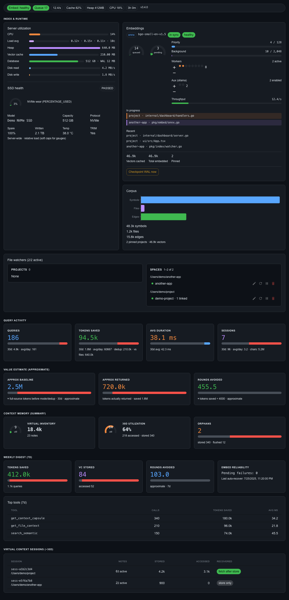

# Plan: README hero, React Storybook in `ui/`, screenshot refresh

One-line summary: Move Storybook into the React `ui` package, capture dark Overview/Memory/(Embeddings/Settings) screenshots from real MUI stories, rewrite README as a layered hero + quick start + links, and relocate embed-backend tables to `docs/embedding-backends.md`.

- **Date:** 2026-07-28
- **Source PRD:** [`prd-readme-docs-refresh.md`](prd-readme-docs-refresh.md)
- **Related:** Post-v3 React-only dashboard; no Jira ticket (`NO-TICKET-readme-docs-refresh` suggested branch)

## Context

### Codebase findings

- Production dashboard is React/MUI under [`ui/`](ui/) (`App.tsx` tabs; dark [`theme.ts`](ui/src/theme.ts); data via [`api/client.ts`](ui/src/api/client.ts)). Overview = `IndexHealthSection` + `OverviewTab`; Memory = `MemoryTab`; Embeddings live inside Index & runtime (`EmbeddingsPanel`); Settings = `SettingsTab`.
- [`dashboard-storybook/`](dashboard-storybook/) still renders **templ HTML** via `DashboardHtml` + [`fixtures.ts`](dashboard-storybook/stories/fixtures.ts) and [`internal/dashboard/static/styles.css`](internal/dashboard/static/styles.css). Capture: [`scripts/capture-screenshot.mjs`](dashboard-storybook/scripts/capture-screenshot.mjs) → `docs/images/dashboard-overview.png` from story `dashboard-overview--overview` (Jun 22–era, unused by README).
- Makefile: `storybook` / `build-storybook` / `dashboard-screenshot` all `cd dashboard-storybook`. `docs/storybook-static/` is **gitignored** ([`.gitignore`](.gitignore) L19) — keep that; “in repo” means buildable.
- README (~512 lines) has no badges and no screenshot embeds; agent workflow + tool tables overlap [`AGENTS.md`](AGENTS.md) / [`docs/USAGE.md`](docs/USAGE.md); embed tables overlap [`skills/operator/SKILL.md`](skills/operator/SKILL.md).
- Orphan [`verify-react-dashboard.mjs`](dashboard-storybook/scripts/verify-react-dashboard.mjs) hits live `:7830` but is not in `package.json`.
- `~/repos/STYLEGUIDE.md` is absent for this repo. Follow existing ast-context-cache patterns: Markdown docs, Makefile targets, Vite/`ui` conventions; do **not** introduce Slide `errs`/`slog` style into docs work.

### Decisions (PRD + planning Q&A)

| Topic | Decision |
|-------|----------|
| Storybook location | **One package:** Storybook lives in **`ui/`** |
| PR shape | **Single PR** (Storybook + screenshots + README + embed doc move) |
| Version badge | Shields.io **GitHub release** + **license** for `coma-toast/ast-context-cache` |
| Embed backends | New **`docs/embedding-backends.md`**; short README + operator skill pointers |
| Extra screenshots | Overview×2, Memory×2 MUST; **Embeddings 1–2 + Settings 1** SHOULD |
| Visual confirm | Checked-in Playwright smoke under `ui/` scripts; Webwright optional/manual |
| `docs/storybook-static/` | Keep **gitignored**; build via `make build-storybook` |
| Verify bar | `make`/local Playwright story smoke; CI optional later (not required for this PR) |

## Requirements (from PRD)

Preserve priorities:

- **MUST:** Layered half-screen hero README; link agents to `AGENTS.md` + MCP JSON; move embed tables out; React `ui/` stories; Overview×2 + Memory×2 dark committed PNGs; Storybook primary capture; Webwright/Playwright visual confirm path; badges (release + license); ship README+Storybook+shots together.
- **SHOULD:** Embeddings + Settings shots; keep one Makefile capture entrypoint; regenerable shots; MUI theme parity; `docs/embedding-backends.md`.
- **MAY:** Trim extra shots if blocked; additional badges; gallery subsection layout.

**Out of scope:** Rewriting AGENTS/skills content; light theme; pixel CI gates; MCP/product behavior changes; full micro-component Storybook; committing `docs/storybook-static/`.

## Approach

**Migrate Storybook into `ui/`** so stories share the same React 19 / MUI / Vite toolchain as production (avoids Vite 6 vs 8 and dual React trees). Retire `dashboard-storybook/` after porting capture/verify scripts and Makefile targets.

**Stories are prop-driven tab/section compositions** (`OverviewTab`, `IndexHealthSection`, `MemoryTab`, `SettingsTab`, `HealthBar`, `EmbeddingsPanel`) with typed fixtures from `ui/src/api/types.ts` — no live API/WebSocket. Action buttons may no-op or toast on missing API; screenshots target read-only layout.

**Capture pipeline:** `npm run build-storybook` → static out dir under `docs/storybook-static` (gitignored) → Playwright screenshots of named stories → `docs/images/*.png` (committed). Rewrite selectors for MUI roots (not `.dashboard-story-root` / templ classes).

**README rewrite last** (or in the same PR after images exist) so hero can embed fresh PNGs. Move embedding backend section verbatim-ish to `docs/embedding-backends.md`.

### Alternatives rejected

| Alternative | Why not |
|-------------|---------|
| Keep `dashboard-storybook/` + alias `../ui/src` | Dual package, Vite 6/8 conflict; user chose one `ui` package |
| Screenshot live `:7830` only | Needs indexed data; PRD wants offline fixtures; Storybook is primary |
| Commit `docs/storybook-static/` | Large binary churn; already gitignored; build-on-demand is enough |
| Split PR (Storybook then README) | User chose one PR |

## Style Guide Notes

- No Slide STYLEGUIDE applies. For any tiny TS helpers: match `ui/` (existing Prettier-less Vite React style; oxlint).
- Docs: prefer clear Markdown; don’t invent new badge systems beyond Shields.
- Do not resurrect templ/`*_templ.go` or HTMX assets for Storybook.

## Detailed Implementation Steps

### Wave 0 — Branch & inventory

1. From updated `main`: `git checkout -b NO-TICKET-readme-docs-refresh`.
2. Confirm PRD status remains Draft until user Approves (implementer may proceed once Approved).

### Wave 1 — Storybook inside `ui/`

3. **Add Storybook 10 + Playwright** to [`ui/package.json`](ui/package.json) scripts:
   - `storybook` → `storybook dev -p 6008 --no-open`
   - `build-storybook` → `storybook build -o ../docs/storybook-static`
   - `capture-screenshot` → node script
   - `verify-stories` → Playwright story smoke
4. Create [`ui/.storybook/main.ts`](ui/.storybook/main.ts): stories `../src/**/*.stories.tsx`; framework `@storybook/react-vite`; align with Vite 8 / `@vitejs/plugin-react` as Storybook 10 supports (pin compatible `@storybook/react-vite` version; if Storybook cannot use Vite 8 yet, document and use Storybook’s bundled Vite while compiling `src/` — prefer matching `ui` Vite major when possible).
5. Create [`ui/.storybook/preview.tsx`](ui/.storybook/preview.tsx): wrap every story with `ThemeProvider` + `CssBaseline` using `dashboardTheme` from [`ui/src/theme.ts`](ui/src/theme.ts); import [`ui/src/index.css`](ui/src/index.css); dark background `#0d1117`.
6. Add [`ui/src/storybook/decorators.tsx`](ui/src/storybook/decorators.tsx): optional `ToastProvider` for panels with buttons.
7. Add [`ui/src/storybook/fixtures.ts`](ui/src/storybook/fixtures.ts): anonymized `Health`, `Stats`, `IndexHealth`, `MemoryData`, `SettingsData`, `WeeklyDigest`, `ContextSessionsResponse` objects (no secrets; fake paths like `/Users/demo/project`).
8. Add stories (titles under `Dashboard/…`):
   - `Overview.stories.tsx` — composed shell strip: `HealthBar` + `IndexHealthSection` + `OverviewTab` (hero); second story focused on Index & runtime / embeddings strip.
   - `Memory.stories.tsx` — Memory tab healthy + with doc sources / empty-ish variants (≤2 screenshot targets).
   - `Embeddings.stories.tsx` — `EmbeddingsPanel` / Index health slice (healthy + degraded/aux) for 1–2 shots.
   - `Settings.stories.tsx` — Settings embedding + virtual context sections (1 shot).
9. Each story wraps content in a stable root for screenshots, e.g. `data-testid="story-frame"` or class `story-frame` (width ~1280).

### Wave 2 — Capture & verify scripts; Makefile

10. Port/adapt [`capture-screenshot.mjs`](dashboard-storybook/scripts/capture-screenshot.mjs) → [`ui/scripts/capture-screenshot.mjs`](ui/scripts/capture-screenshot.mjs):
    - Serve `docs/storybook-static` on 6018.
    - Capture **multiple** story IDs → named files under `docs/images/`:
      - `dashboard-overview.png`, `dashboard-overview-index-runtime.png` (or similar)
      - `dashboard-memory.png`, `dashboard-memory-docs.png`
      - `dashboard-embeddings.png` (+ optional second)
      - `dashboard-settings.png`
    - Viewport 1280×1800; screenshot `.story-frame` / `[data-testid=story-frame]` (not templ `.dashboard-story-root`).
11. Add [`ui/scripts/verify-stories.mjs`](ui/scripts/verify-stories.mjs): Playwright opens Overview + Memory stories; asserts MUI-ish signals (e.g. text “Index & runtime”, “Query activity”, “Memory”, dark `body` background) — replace templ class checklist from `verify-overview.mjs`.
12. Add [`ui/scripts/verify-visual-vs-live.mjs`](ui/scripts/verify-visual-vs-live.mjs) (optional live): if `http://localhost:7830/dashboard/` is up, open Overview and Storybook Overview side-by-side or sequential; log “manual visual confirm” checklist (PRD: visual judgment enough). Document Webwright as alternate maintainer path in Storybook README section.
13. Update [`Makefile`](Makefile):
    - `storybook` / `build-storybook` / `dashboard-screenshot` → `cd ui && …`
    - Keep target name `dashboard-screenshot` as official entrypoint (PRD SHOULD).
    - Optionally list these in `make help`.
14. Delete or archive [`dashboard-storybook/`](dashboard-storybook/) after scripts/stories exist in `ui/` (remove package; update any docs that reference `cd dashboard-storybook`).
15. Update ignore notes if needed; keep `docs/storybook-static/` gitignored.

### Wave 3 — Docs: embed backends + README

16. Create [`docs/embedding-backends.md`](docs/embedding-backends.md): move the README “Embedding backends” table, Docker Model Runner notes, env override vs dashboard Settings, health fields — from current README (~L62–88) plus any operator-skill gaps; link back to README Quick Start.
17. Patch [`skills/operator/SKILL.md`](skills/operator/SKILL.md): point to `docs/embedding-backends.md` as canonical table (avoid three copies).
18. Rewrite [`README.md`](README.md) structure:

```text
# ast-context-cache
[badges: release | license]

## Hero
goal paragraph
primary bullets (A1, A2, A8, A9 then remaining A…)


## Quick Start
(make setup / run; ports; after git pull)

## Configure your editor
MCP JSON (Cursor / OpenCode / …)
Agents: see AGENTS.md (thin pointer)

## Features
Primary (expanded) then Supporting (B3, B4, B1, B2, rest)
Gallery or inline images for Memory / Embeddings / Settings

## Shell / mcp-local / Tool tiers
(keep shorter; tiers can stay or summarize + link AGENTS)

## Architecture / DB / Migrating 3.0
(compress; link docs)

## License
```

19. Remove long “For AI Agents” workflow / virtual context essay / token tables from README (keep 3–5 lines + links to `AGENTS.md` and `skills/usage/SKILL.md`).
20. Add badges at top:

```markdown
[](https://github.com/coma-toast/ast-context-cache/releases)
[](LICENSE)
```

(Adjust license badge if LICENSE file name/path differs.)

21. Embed Overview hero near top; place other PNGs in a short **Screenshots** gallery or next to Features/Dashboard mentions (≤2 per page as captured).
22. Fix mcp-local pointer; ensure license section remains.

### Wave 4 — Generate artifacts & PRD sync

23. Run `make build-storybook && make dashboard-screenshot` (or `cd ui && npm run …`); commit PNGs under `docs/images/`.
24. Run `npm run verify-stories` in `ui/`; manually open Storybook Overview vs live dashboard once (visual confirm); note in PR description.
25. Update PRD status to Approved only if user already approved; else leave Draft and reference plan.
26. Open single PR with README + `ui` Storybook + images + `docs/embedding-backends.md` + Makefile + removal of `dashboard-storybook/`.

## Testing Strategy

| Check | How |
|-------|-----|
| Storybook builds | `make build-storybook` exits 0; `docs/storybook-static` exists locally |
| Stories render React | `verify-stories.mjs` finds Overview/Memory copy; no templ class requirements |
| Screenshots | PNGs exist and are referenced from README; dark theme visible |
| README links | Relative links to `AGENTS.md`, `docs/embedding-backends.md`, images resolve |
| No secrets in fixtures | Grep fixtures for `sk-`, `Bearer`, real home paths |
| Live visual (manual) | Storybook Overview ≈ `:7830` Overview (dark MUI) |

### PRD acceptance → tests

| AC | Verification |
|----|----------------|
| Hero communicates goal + A1/A2/A8/A9 | Human read of README top |
| Agents directed to AGENTS.md | No full workflow section; link present |
| Embed tables outside README | `docs/embedding-backends.md` + README pointer |
| React stories | Stories import from `ui/src/…`; no `DashboardHtml` |
| `make dashboard-screenshot` | Updates Overview images |
| Visual confirm | verify script + PR note |
| Memory×2 images | Files + README refs |
| Badges | Render on GitHub |
| storybook-static buildable | make target |
| One PR ships all three | PR file list |

## Risks & Open Questions

| Risk | Mitigation |
|------|------------|
| Storybook 10 + Vite 8 friction | Pin compatible Storybook/Vite; fall back to Storybook-managed Vite compiling `src/` |
| Settings/Memory stories trigger `api` on click | Screenshot idle state; stub `api` module in Storybook preview if needed via Vite alias to `storybook/api-stub.ts` |
| Large PNGs | Compress; crop to `.story-frame` |
| README still long after rewrite | Be ruthless moving agent/token prose to AGENTS/USAGE |
| Removing `dashboard-storybook` breaks bookmarks | Makefile + README + skill pointers updated in same PR |

**Remaining low-confidence:** Exact Storybook story IDs after rename (capture script list updated in same change). License badge path if `LICENSE` vs `LICENSE.md`.

## Suggested next steps

1. User marks [`prd-readme-docs-refresh.md`](prd-readme-docs-refresh.md) **Approved** (if not already).
2. Run **`proj-impl`** against this plan (or implement Wave 1→4 in order).
3. Single PR from `NO-TICKET-readme-docs-refresh`.
